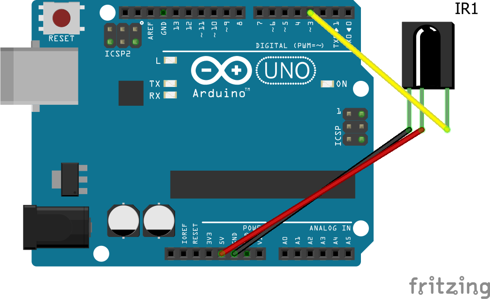
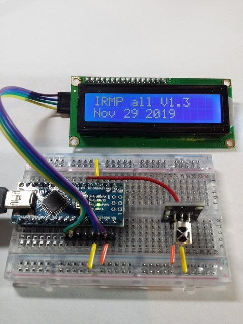
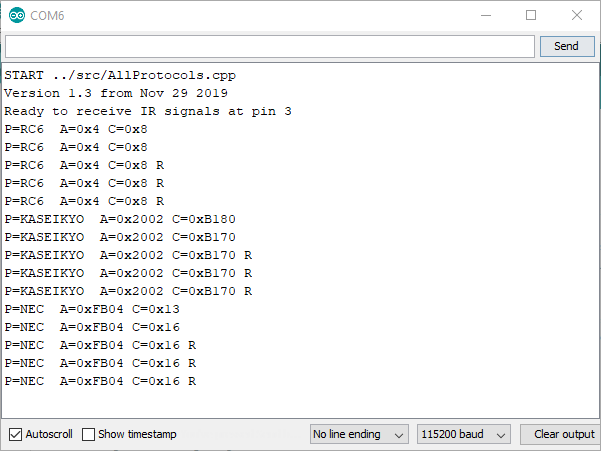
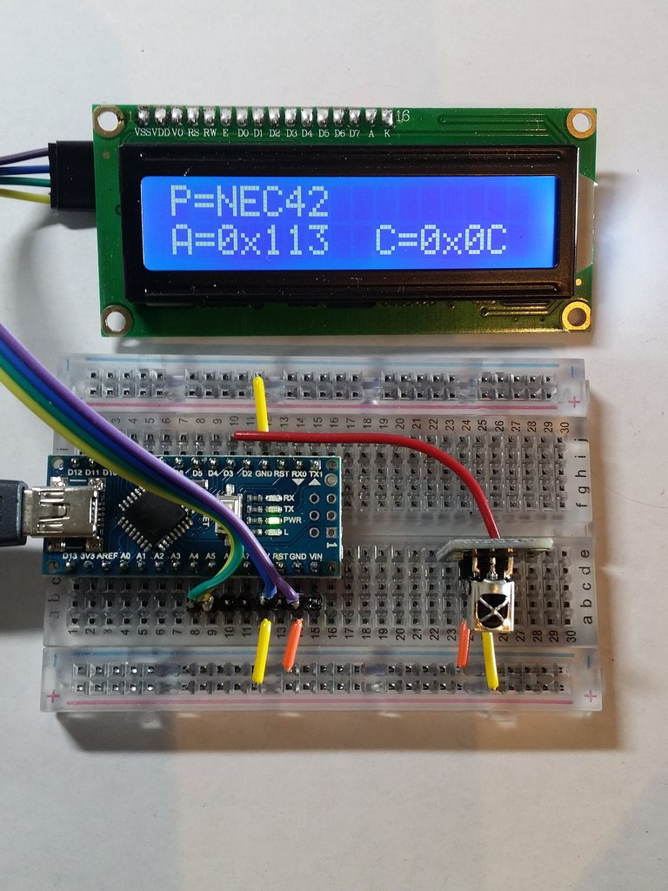
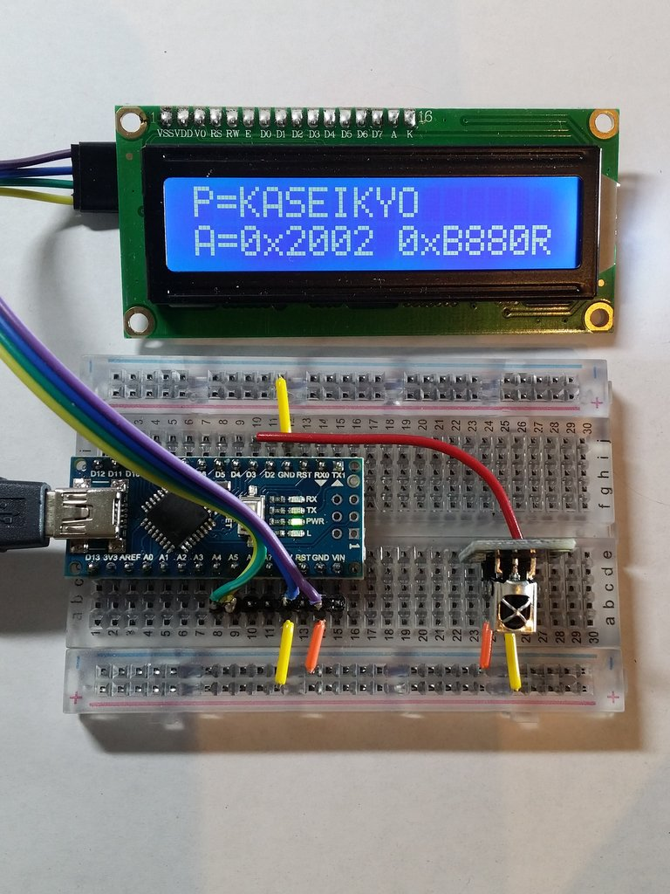
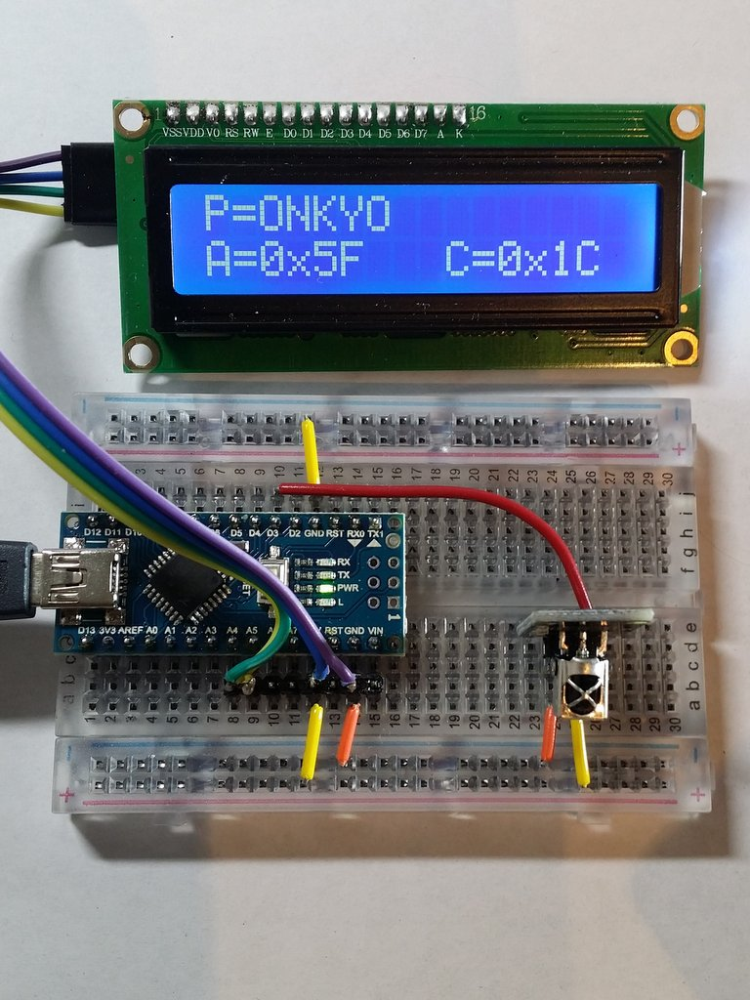
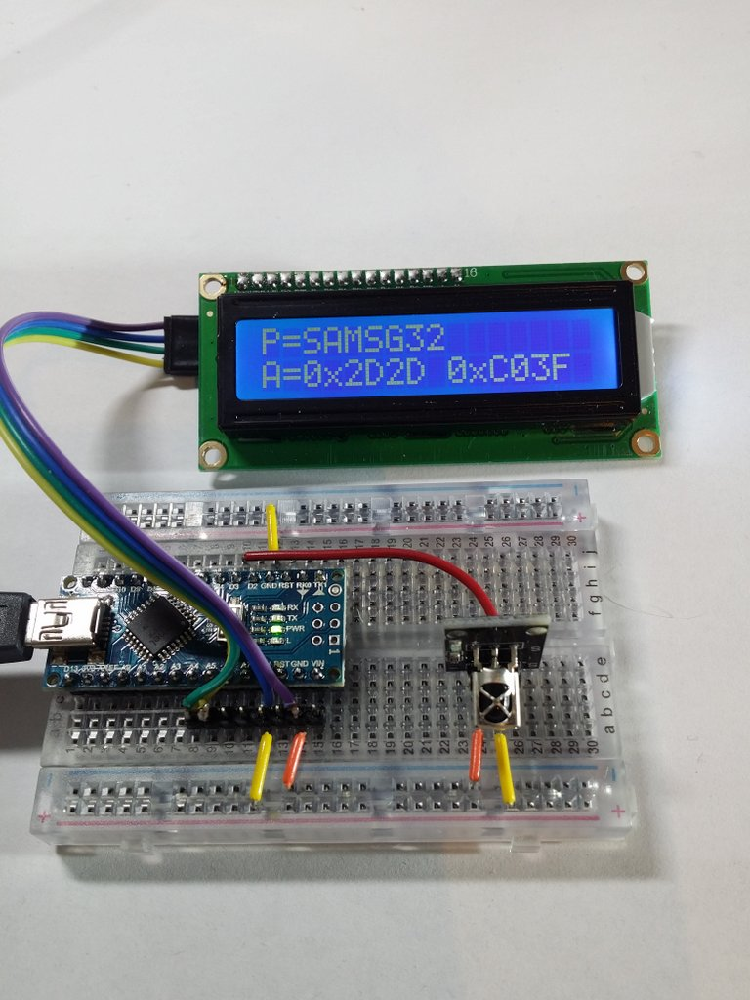
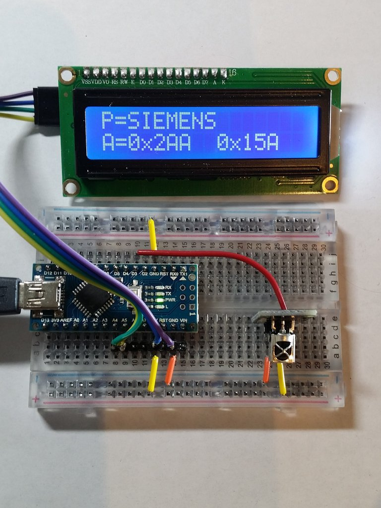

# [IRMP](https://github.com/ukw100/IRMP) - Infrared Multi Protocol Decoder + Encoder
Available as Arduino library "IRMP"

### [Version 2.2.0](https://github.com/ukw100/IRMP/releases)

[](https://www.gnu.org/licenses/gpl-3.0)
[](https://github.com/ukw100/irmp/commits/master)
[](https://github.com/ukw100/irmp/actions)
[](https://github.com/brentvollebregt/hit-counter)

## 50 IR protocols supported and low memory footprint
- Only 40 protocols can be enabled for receive at the same time, because some of them are quite similar and conflicts with each other.
- 39 protocols are available for send.
- FLASH usage in bytes: 1500 for one protocol, 4300 for 15 main and 8000 for all 40 protocols.
- RAM usage in bytes: 52, 73 and 100.

| Nano running AllProtocol example | YouTube Video | Instructable |
|-|-|-|
|  |  | [](https://www.instructables.com/id/IR-Remote-Analyzer-Receiver-With-Arduino) |
 
# List of protocols
- Sony SIRCS, NEC + APPLE + ONKYO, Samsung + Samsg32, Kaseikyo
- JVC, NEC16, NEC42, Matsushita, DENON, Sharp, RC5, RC6 & RC6A, IR60 (SDA2008) Grundig, Siemens Gigaset, Nokia
- BOSE, Kathrein , NUBERT , FAN (ventilator) , SPEAKER (~NUBERT), Bang & Olufsen , RECS80 (SAA3004) , RECS80EXT (SAA3008), Thomson, NIKON camera , Netbox keyboard, ORTEK (Hama) , Telefunken 1560, FDC3402 keyboard , RC Car , iRobot Roomba, RUWIDO, T-Home , A1 TV BOX, LEGO Power RC, RCMM 12,24, or 32, LG Air Condition , Samsung48, Merlin , Pentax , S100 , ACP24, TECHNICS , PANASONIC Beamer , Mitsubishi Aircond , VINCENT, SAMSUNG AH , IRMP specific, GREE CLIMATE , RCII T+A, RADIO e.g. TEVION, METZ<br/>
- **NEC, Kaseiko, Denon, RC6, Samsung + Samsg32 were sucessfully tested in interrupt mode.**

# Features
- Interrupt mode for major protocols.
- Supports inverted feedback LED for send and receive feedback.
- Supports inverted IR output for LED connected to VCC.
- Compatible with Arduino tone() library.

# Schematic for Arduino UNO
| IR-Receiver connection | Serial LCD connection |
|---|---|
 | 

# Quick comparison of 4 Arduino IR receiving libraries
## This is a short comparison and may not be complete or correct
I created this comparison matrix for [myself](https://github.com/ArminJo) in order to choose a small IR lib for my project and to have a quick overview, when to choose which library.<br/>
It is dated from **30.3.2020**. If you have complains about the data or request for extensions, please send a PM or open an issue.

| Subject | [IRMP](https://github.com/ukw100/IRMP) | [IRLremote](https://github.com/NicoHood/IRLremote) | [IRLib2](https://github.com/cyborg5/IRLib2)<br/>**mostly unmaintained** | [IRremote](https://github.com/z3t0/Arduino-IRremote) |
|---------|------|-----------|--------|----------|
| Number of protocols | **50** | Nec + Panasonic + Hash \* | 12 + Hash \* | 13 |
| 3.Party libs needed| % | PinChangeInterrupt if not pin 2 or 3 | % | % |
| Timing method receive | Timer2 or interrupt for pin 2 or 3 | **Interrupt** | Timer2 or interrupt for pin 2 or 3 | Timer2 |
| Timing method send | Timer2 interrupts | Timer2 intgerrupts | Timer2 and blocking wait | ? |
| Send pins| All | All | All ? | ? |
| Decode method | OnTheFly | OnTheFly | RAM | RAM |
| Encode method | OnTheFly | ? | OnTheFly | ? |
| FLASH usage (simple NEC example with 5 prints) | 1500<br/>(4300 for 15 main / 8000 for all 40 protocols)<br/>(+200 for callback)<br/>
(+80 for interrupt at pin 2+3)| **1270**<br/>(1400 for pin 2+3) | 4830 | 3210 |
| RAM usage | **52**<br/>(73 / 100 for 15 (main) / 40 protocols) | **62** | 334 | 227 |
| Supported platforms | **avr, attiny, Digispark (Pro), esp8266, ESP32, STM32, SAMD 21, Apollo3<br/>(plus arm and pic for non Arduino IDE)** | avr, esp8266 | avr, SAMD 21, SAMD 51 | avr, attiny, *esp8266*, esp32, arm(some boards) |
| Last library update | 4/2020 | 4/2018 | 9/2019 | 11/2017 |
| Remarks | LED 13 Feedback.<br/>Decodes 40 protocols concurrently.<br/>39 Protocols to send.<br/>Work in progress. | Only one protocol at a time. | Consists of 5 libraries. LED 13 Feedback. **Project containing bugs - 45 issues, no reaction for at least one year.** | LED 13 Feedback.<br/> Decoding is very basic and timing sensitive.<br/>**213 open issues and therefore an incredible amount of forks.** |

\*The Hash protocol gives you a hash as code, which may be sufficient to distinguish your keys on the remote, but may not work with some protocols like Mitsubishi

# Easy migrating your code from IRremote to IRMP
See also the [SimpleReceiver example](examples/SimpleReceiver/SimpleReceiver.ino) .

### Change the include and declarations from:
```
#include <IRremote.h>
#define IR_RECEIVER_PIN 3
IRrecv myReceiver(IR_RECEIVER_PIN);
decode_results results;
```
to
```
#define IRMP_INPUT_PIN 3
#define IRMP_PROTOCOL_NAMES 1
#include <irmpSelectMain15Protocols.h>
#include <irmp.c.h>
IRMP_DATA irmp_data[1];
```

### Change in setup:
`myReceiver.enableIRIn();` to `irmp_init();`

### Changes to get the data:
`if (myReceiver.decode(&results))` to `if (irmp_get_data(&irmp_data[0]))`<br/>
and<br/>
`switch (results.value)` to `switch (irmp_data[0].command)`.

You do not need **`myReceiver.resume();`** any more, just delete it.

The IR code representation of IRMP is different from that in IRremote. In IRMP (as in IRLremote) it is more standard and simpler. Use the function `irmp_result_print(&irmp_data[0])` to print the IR code representation. Seee [SimpleReceiver example](examples/SimpleReceiver/SimpleReceiver.ino).

If you want to distinguish between more than one remote in one sketch, you may also use `irmp_data[0].address` like it is done in the [Callback example](examples/Callback/Callback.ino).

# Timer usage
The IRMP **receive** library works by polling the input pin at a rate of 10 to 20 kHz. Default is 15 kHz.<br/>
The IRMP **send** library works by bit banging the output pin at a frequency of 38 kHz. This **avoids blocking waits** and allows to choose an **arbitrary pin**, you are not restricted to pin 3 or 11. Send Interrupts require 50% CPU time on a 16 MHz AVR.<br/>
The **tone() library is still available**. You can use it alternating with IR receive and send, see [ReceiveAndSend example](examples/ReceiveAndSend/ReceiveAndSend.ino).

**Some protocols can be received by just using interrupts from the input pin** instead of polling by defining `IRMP_ENABLE_PIN_CHANGE_INTERRUPT`. In this case **no timer is needed**. See [Interrupt example](examples/Interrupt/Interrupt.ino).<br/>

- For AVR **timer 2 (Tone timer)** is used for receiving **and** sending. For variants, which have no timer 2 like ATtiny85 or ATtiny167, **timer 1** is used.
- For SAMD **TC3** is used.
- For Apollo3 **Timer 3 segment B** is used.
- For ESP8266 and ESP32 **timer1** is used.
- For STM32 (BluePill) **timer 3 (Servo timer) channel 1** is used as default.<br/>
- If you use polling (default) mode with timer 2, the `millis()` function and the corresponding timer is not used by IRMP! 
- In Interrupt mode, the `micros()` function is used as timebase.


# AllProtocol example
| Serial LCD output | Arduino Serial Monitor output |
|-|-|
|  |  |

## Sample Protocols
| | | | |
|-|-|-|-|
| |  | | |
|  | | | |
|  | | | |
|  | | | |


# Documentation at mikrocontroller.net
### English
   http://www.mikrocontroller.net/articles/IRMP_-_english<br/>
   http://www.mikrocontroller.net/articles/IRSND_-_english
### German
   http://www.mikrocontroller.net/articles/IRMP<br/>
   http://www.mikrocontroller.net/articles/IRSND
  
  
# Revision History
### Version 2.2.1
- Improved pin layout.
- Fixed bug with stm32duino 1.9.
- Version number.
- Blink13 -> LEDFeedback.

### Version 2.2.0
- Supported **Apollo3** platform.
- Fixed DigisparkPro bug.

### Version 2.1.0
- Supported **SAMD** platform.
- IRSND enabled for non AVR platforms.

### Version 2.0.0
- Added IR send fuctionality (IRSND).
- Use `TIMER2_COMPB_vect` to be compatible with tone() library.
- No longer required to call initPCIInterrupt() manually if IRMP_ENABLE_PIN_CHANGE_INTERRUPT is set.
- Separated code for timer to IRTimer.cpp.h.
- Separated code for Pin change interrupt to irmpPinChangeInterrupt.cpp.h.
- Fixed wrong pin numbers for BluePill.

### Version 1.2.2
- Fixed bugs introduced in 1.2.1.
 
### Version 1.2.1
- Bug for AVR architecture fixed.
- ATtiny85 + ATtiny167 support for ATTinyCore and Digistump core.
- Support for "Generic STM32F1 series" from STM32 Boards from STM32 cores of Arduino Board manager.

### Version 1.2.0 - This version contains a bug for the AVR architecture
- Added STM32 M3 (BluePill) support.

### Version 1.1.0
- Added functions `irmp_disable_timer_interrupt()` and `irmp_enable_timer_interrupt()`.
- Added function `irmp_result_print(Stream * aSerial)`.
- Improved examples.

### Version 1.0.1
- Added ESP8266 + ESP32 support.

# CI
Since Travis CI is unreliable and slow (5 times slower), the library examples are now tested with GitHub Actions for the following boards:

- arduino:avr:uno
- arduino:avr:mega
- arduino:samd:arduino_zero_edbg
- digistump:avr:digispark-tiny16
- digistump:avr:digispark-pro (ATtiny167)
- ATTinyCore:avr:attinyx5:chip=85,clock=8internal
- esp8266:esp8266:huzzah:eesz=4M3M,xtal=80
- esp32:esp32:featheresp32:FlashFreq=80
- STM32:stm32:GenF1:pnum=BLUEPILL_F103C8

#### If you find this library useful, please give it a star.
