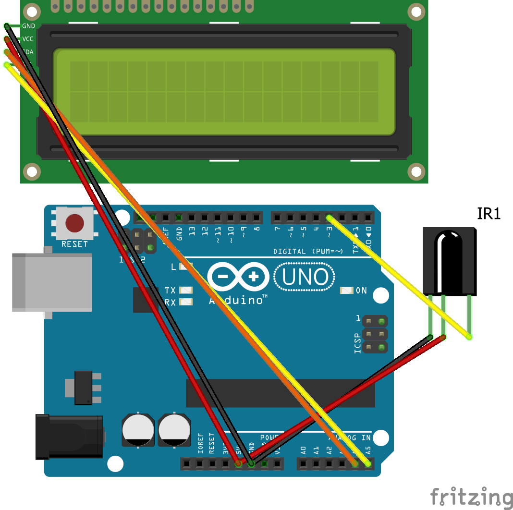
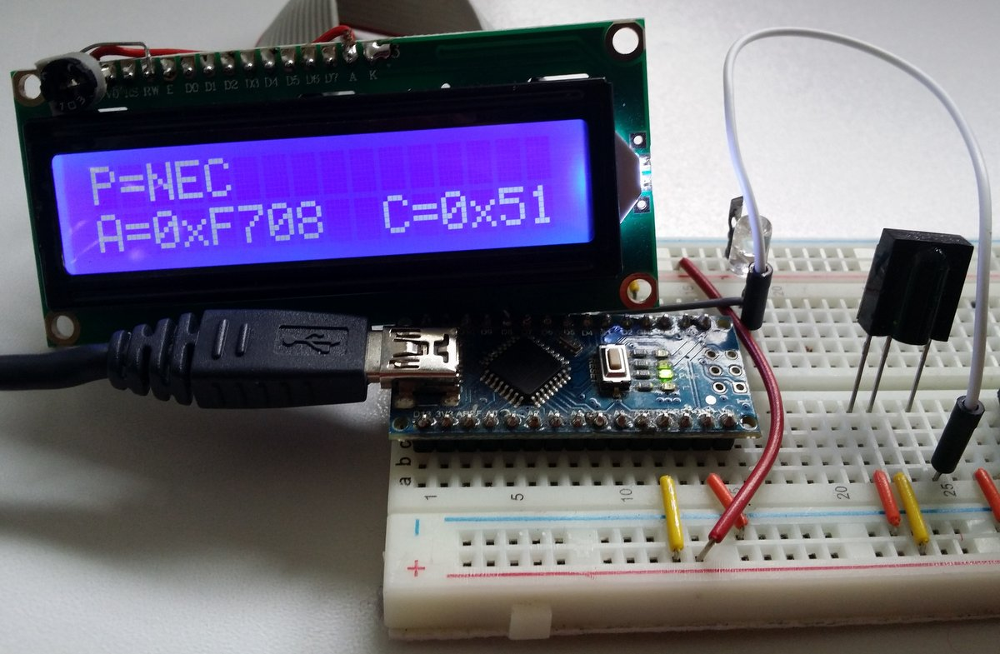
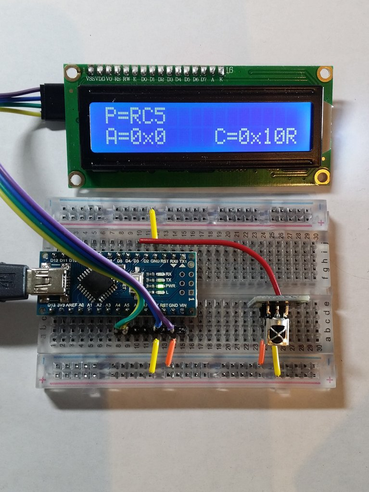
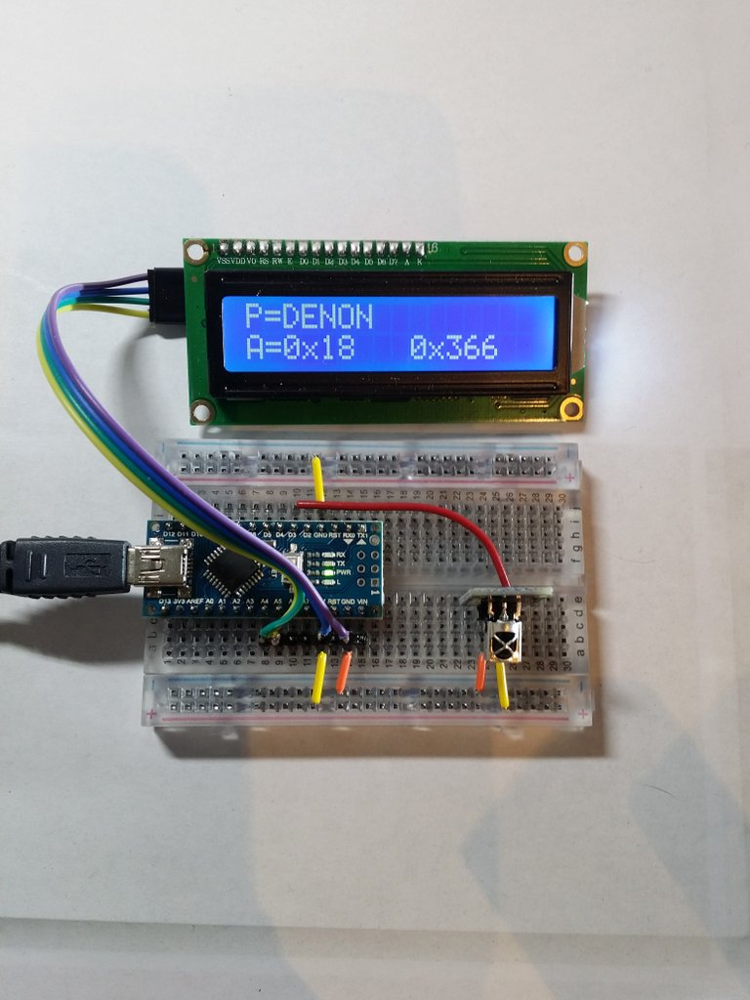
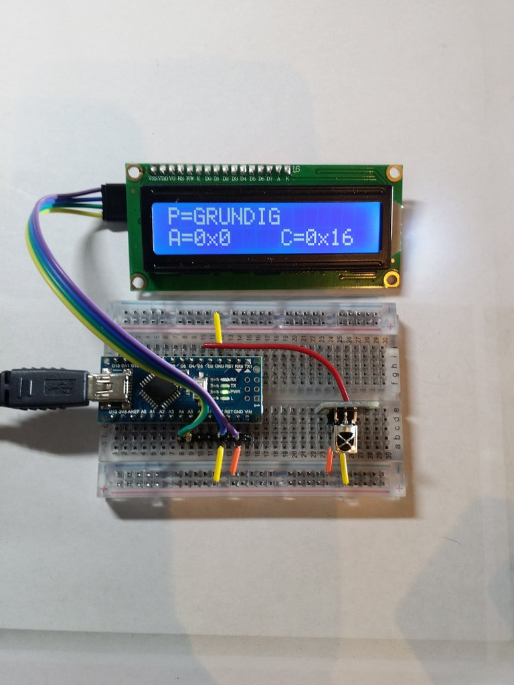
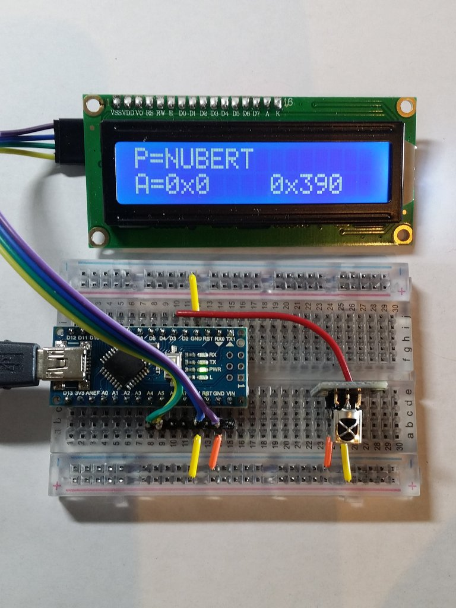
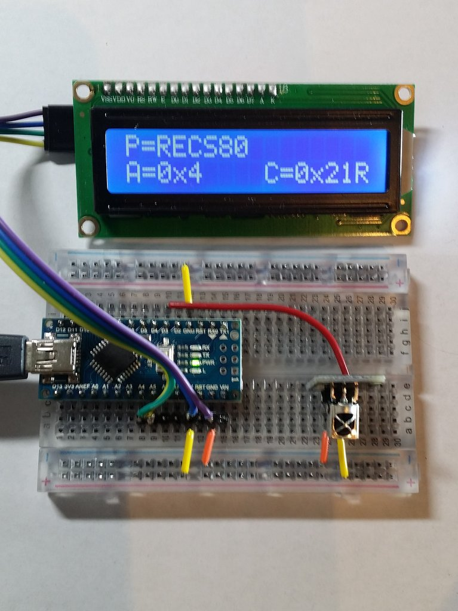

# [IRMP](https://github.com/IRMP-org/IRMP) - Infrared Multi Protocol Decoder + Encoder
Available as Arduino library "IRMP"

### [Version 3.6.3](https://github.com/IRMP-org/IRMP/archive/master.zip) - work in progress

[](https://www.gnu.org/licenses/gpl-3.0)
[](https://www.ardu-badge.com/IRMP)
[](https://github.com/IRMP-org/IRMP/commits/master)
[](https://github.com/IRMP-org/IRMP/actions)


## 50 IR protocols supported and low memory footprint
- Only 39 protocols can be enabled for receive at the same time, because some of them are quite similar and conflicts with each other.
- 39 protocols are available for send.
- FLASH usage in bytes: 1500 for one protocol, 4300 for 15 main and 8000 for all 39 protocols.
- RAM usage in bytes: 52, 73 and 100.

| Nano running AllProtocol example | YouTube Video | Instructable |
|-|-|-|
|  |  | [](https://www.instructables.com/id/IR-Remote-Analyzer-Receiver-With-Arduino) |

<br/>

# List of protocols
` Sony SIRCS ` &nbsp; &nbsp; ` NEC + APPLE + ONKYO ` &nbsp; &nbsp; ` Samsung + Samsg32 ` &nbsp; &nbsp; ` Kaseikyo `

` JVC ` &nbsp; &nbsp; ` NEC16 + NEC42 ` &nbsp; &nbsp; ` Matsushita ` &nbsp; &nbsp; ` DENON `
&nbsp; &nbsp; ` Sharp ` &nbsp; &nbsp; ` RC5 ` &nbsp; &nbsp; ` RC6 & RC6A ` &nbsp; &nbsp; ` IR60 (SDA2008) Grundig `
&nbsp; &nbsp; ` Siemens Gigaset ` &nbsp; &nbsp; ` Nokia `

` BOSE ` &nbsp; &nbsp; ` Kathrein ` &nbsp; &nbsp; ` NUBERT ` &nbsp; &nbsp; ` FAN (ventilator) `
&nbsp; &nbsp; ` SPEAKER (~NUBERT) ` &nbsp; &nbsp; ` Bang & Olufsen ` &nbsp; &nbsp; ` RECS80 (SAA3004) `<br/>
&nbsp; &nbsp; ` RECS80EXT (SAA3008) ` &nbsp; &nbsp; ` Thomson ` &nbsp; &nbsp; ` NIKON camera `
&nbsp; &nbsp; ` Netbox keyboard ` &nbsp; &nbsp; ` ORTEK (Hama) ` &nbsp; &nbsp; ` Telefunken 1560 `<br/>
&nbsp; &nbsp; ` FDC3402 keyboard ` &nbsp; &nbsp; ` RC Car ` &nbsp; &nbsp; ` iRobot Roomba `
&nbsp; &nbsp; ` RUWIDO ` &nbsp; &nbsp; ` T-Home ` &nbsp; &nbsp; ` A1 TV BOX ` &nbsp; &nbsp;` LEGO Power RC `<br/>
&nbsp; &nbsp; ` RCMM 12,24, or 32 ` &nbsp; &nbsp; ` LG Air Condition ` &nbsp; &nbsp; ` Samsung48 `
&nbsp; &nbsp; ` Merlin ` &nbsp; &nbsp; ` Pentax ` &nbsp; &nbsp; ` S100 ` &nbsp; &nbsp; ` ACP24 ` &nbsp; &nbsp; ` TECHNICS `<br/>
&nbsp; &nbsp; ` PANASONIC Beamer ` &nbsp; &nbsp; ` Mitsubishi Aircond ` &nbsp; &nbsp; ` VINCENT `
&nbsp; &nbsp; ` SAMSUNG AH ` &nbsp; &nbsp; ` GREE CLIMATE `  &nbsp; &nbsp; ` RCII T+A `<br/>
 &nbsp; &nbsp; ` RADIO e.g. TEVION ` &nbsp; &nbsp; ` METZ `

` NEC ` &nbsp; &nbsp; ` Kaseiko ` &nbsp; &nbsp; ` Denon ` &nbsp; &nbsp; ` RC6 ` &nbsp; &nbsp; ` Samsung + Samsg32 ` &nbsp; were successfully tested in **interrupt mode**, but there are many protocols which **in principle cannot be decoded** in this mode.

<br/>

# Features
- You may use **every pin for input or output**.
- Interrupt mode for major protocols.
- Callback after successful receive of a command.
- Support for inverted feedback LED (for send and receive feedback).
- Support for inverted IR output for LED connected to VCC.
- Unmodulated IR signal output enables direct replacment of an IR receiver circuit.
- Compatible with Arduino tone library.
- Send can also also wait for trailing space/gap.

# Restrictions
- Send IR frequency is fixed at 38 kHz.
<br/>

# Minimal version
For applications only requiring NEC protocol, there is a receiver which has very **small codesize of 500 bytes and does NOT require any timer**. See the MinimalReceiver and IRDispatcherDemo example how to use it. Mapping of pins to interrupts can be found [here](https://github.com/Arduino-IRremote/Arduino-IRremote/tree/master/src/TinyIRReceiver.hpp#L259).
<br/>

# Schematic for Arduino UNO
The VS1838B is used as receiver for all examples and tests. This module has a 120 µs on/low and a 100 µs off/high delay between received signal and output. So it shortens the mark and extends the space by 20 µs.
| IR-Receiver connection | Serial LCD connection |
|---|---|
 | 
<br/>

# Supported Arduino architectures / CPU's / boards
Digispark boards are tested with the recommended [ATTinyCore](https://github.com/SpenceKonde/ATTinyCore) using `New Style` pin mapping for the pro board.
| Architecture | CPU | Board |
|:---|---:|----:|
| avr     | ATmega16, ATmega328P, ATmega32U4, ATtinyX5, ATtinyX7 | Uno, Nano, Leonardo, Sparkfun Pro Micro, Digispark etc. |
| megaavr | ATmega4809 | Uno WiFi Rev 2, Nano Every |
| samd    | SAMD21G18A | Zero, MKR*, etc. **but not DUE, which is sam architecture** |
| esp8266 | % | all |
| esp32   | % | all |
| stm32   | STM32F1xx     | BluePill |
| STM32F1 | STM32F1xx     | BluePill |
| apollo3 | Ambiq Apollo3 | Sparkfun Apollo3 + Artemis |
| mbed    | nRF528x       | Nano 33 BLE |
| Teensiduino | all  - but [limited support](https://forum.pjrc.com/threads/65912-Enable-Continuous-Integration-with-arduino-cli-for-3-party-libraries) | >= Teensy 3 |
<br/>

# Quick comparison of 4 Arduino IR receiving libraries
## This is a short comparison and may not be complete or correct
I created this comparison matrix for [myself](https://github.com/ArminJo) in order to choose a small IR lib for my project and to have a quick overview, when to choose which library.<br/>
It is dated from **24.06.2022**. If you have complains about the data or request for extensions, please send a PM or open a discussion.

| Subject | [IRMP](https://github.com/IRMP-org/IRMP) | [IRLremote](https://github.com/NicoHood/IRLremote) | [IRLib2](https://github.com/cyborg5/IRLib2)<br/>**mostly unmaintained** | [IRremote](https://github.com/Arduino-IRremote/Arduino-IRremote) | [Minimal NEC](https://github.com/Arduino-IRremote/Arduino-IRremote/tree/master/examples/MinimalReceiver) | [IRsmallDecoder](https://github.com/LuisMiCa/IRsmallDecoder)
|---------|------|-----------|--------|----------|----------|----------|
| Number of protocols | **50** | Nec + Panasonic + Hash \* | 12 + Hash \* | 17 + PulseDistance + Hash \* | NEC | NEC + RC5 + Sony + Samsung |
| Timing method receive | Timer2 or interrupt for pin 2 or 3 | **Interrupt** | Timer2 or interrupt for pin 2 or 3 | Timer2 | **Interrupt** | **Interrupt** |
| Timing method send | PWM and timing with Timer2 interrupts | Timer2 interrupts | Timer2 and blocking wait | PWM with Timer2 and/or blocking wait with delay<br/>Microseconds() | blocking wait with delay<br/>Microseconds() | % |
| Send pins| All | All | All ? | Timer dependent | All | % |
| Decode method | OnTheFly | OnTheFly | RAM | RAM | OnTheFly | OnTheFly |
| Encode method | OnTheFly | OnTheFly | OnTheFly | OnTheFly or RAM | OnTheFly | % |
| Callback suppport | x | % | % | x | x | % |
| Repeat handling | Receive + Send (partially) | % | ? | Receive + Send | Receive + Send | Receive |
| LED feedback | x | % | x | x | Receive | % |
| FLASH usage (simple NEC example with 5 prints) | 1820<br/>(4300 for 15 main / 8000 for all 40 protocols)<br/>(+200 for callback)<br/>(+80 for interrupt at pin 2+3)| 1270<br/>(1400 for pin 2+3) | 4830 | 1770 | **900** | ?1100? |
| RAM usage | 52<br/>(73 / 100 for 15 (main) / 40 protocols) | 62 | 334 | 227 | **19** | 29 |
| Supported platforms | **avr, megaavr, attiny, Digispark (Pro), esp8266, ESP32, STM32, SAMD 21, Apollo3<br/>(plus arm and pic for non Arduino IDE)** | avr, esp8266 | avr, SAMD 21, SAMD 51 | avr, attiny, [esp8266](https://github.com/crankyoldgit/IRremoteESP8266), esp32, SAM, SAMD | **All platforms with attach<br/>Interrupt()** | **All platforms with attach<br/>Interrupt()** |
| Last library update | 6/2022 | 4/2018 | 3/2022 | 6/2022 | 6/2022 | 2/2022 |
| Remarks | Decodes 40 protocols concurrently.<br/>39 Protocols to send.<br/>Work in progress. | Only one protocol at a time. | Consists of 5 libraries. **Project containing bugs - 45 issues, no reaction for at least one year.** | Universal decoder and encoder.<br/>Supports **Pronto** codes and sending of raw timing values. | Requires no timer. | Requires no timer. |

\* The Hash protocol gives you a hash as code, which may be sufficient to distinguish your keys on the remote, but may not work with some protocols like Mitsubishi

<br/>

# Pin usage
You may use **every pin for input or output**, just define it like `#define IRMP_INPUT_PIN 2` and `#define IRSND_OUTPUT_PIN 3`. The PWM of the output pin is generated by software bit banging.

# Dynamic pins numbers
If you want to use pin numbers for input, output and LED feedback specified at runtime, you must define `IRMP_IRSND_ALLOW_DYNAMIC_PINS`. See [ReceiveAndSendDynamicPins example](examples/ReceiveAndSendDynamicPins/ReceiveAndSendDynamicPins.ino).<br/>
The `irmp_init` and `irsnd_init` function then allows up to 3 parameters `uint_fast8_t aIrmpInputPin/aIrsndOutputPin, uint_fast8_t aIrmpFeedbackLedPin, bool aIrmpLedFeedbackPinIsActiveLow`.<br/>
Be aware, only one pin and enable flag for receive and send feedback LED is supported.

<br/>

# Receiving and sending simultaneously
Receiving and sending is possible with this library, but since we use only 1 timer, receiving is inhibited while sending the IR signal.<br/>
Sending the IR signal starts with saving current timer configuration, setting the timer to the send configuration / frequency, sending the signal (and waiting for the gap after the signal) and then automatically reset the timer to its previous (receiving) configuration.

<br/>

# API
### IRMP

```c++
// Init functions
void irmp_init (void);
void irmp_init(uint_fast8_t aIrmpInputPin);
void irmp_init(uint_fast8_t aIrmpInputPin, uint_fast8_t aIrmpFeedbackLedPin);
void irmp_init(uint_fast8_t aIrmpInputPin, uint_fast8_t aIrmpFeedbackLedPin, bool aIrmpLedFeedbackPinIsActiveLow);
void irmp_register_complete_callback_function(void (*aCompleteCallbackFunction)(void));

// Info function
bool irmp_IsBusy();
void irmp_print_active_protocols(Print *aSerial);

// Main check for result function used in loop()
bool irmp_get_data (IRMP_DATA *)

// Result print functions
void irmp_result_print(Print *aSerial, IRMP_DATA * aIRMPDataPtr);
void irmp_result_print(IRMP_DATA *aIRMPDataPtr);
```
### IRSND

```c++
// Init functions
void irsnd_init (void);
// 3 additional init functions if IRMP_IRSND_ALLOW_DYNAMIC_PINS is defined
void irsnd_init(uint_fast8_t aIrsndOutputPin);
void irsnd_init(uint_fast8_t aIrsndOutputPin, uint_fast8_t aIrmpFeedbackLedPin);
void irsnd_init(uint_fast8_t aIrsndOutputPin, uint_fast8_t aIrmpFeedbackLedPin, bool aIrmpLedFeedbackPinIsActiveLow);

// Send function - sends frame AND trailing space
bool irsnd_send_data (IRMP_DATA *, uint8_t);

// Info functions
bool irsnd_is_busy (void);

void irsnd_stop (void);
```
### IRMP and IRSND

```c++
// LED feedback function
void irmp_irsnd_LEDFeedback(bool aEnableBlinkLed);

// Timer management functions for 
void disableIRTimerInterrupt(void);
void enableIRTimerInterrupt(void);
void storeIRTimer(void);
void restoreIRTimer(void);
```
<br/>

# Examples
In order to fit the examples to the 8K flash of ATtiny85 and ATtiny88, the [Arduino library ATtinySerialOut](https://github.com/ArminJo/ATtinySerialOut) is required for this CPU's.

### SimpleReceiver + SimpleSender
This examples are a good starting point.<br/>
SimpleReceiver can be tested online with [WOKWI](https://wokwi.com/arduino/projects/298945438795432456).
Click on the receiver while simulation is running to specify individual IR codes.

### MinimalReceiver + SmallReceiver
If code size matters, look at these examples.<br/>
MinimalReceiver can be tested online with [WOKWI](https://wokwi.com/arduino/projects/299034264157028877).
Click on the receiver while simulation is running to specify individual IR codes.

### ReceiverTimingAnalysis
This example analyzes the signal delivered by your IR receiver module.
Values can be used to determine the stability of the received signal as well as a hint for determining the protocol.<br/>
It also computes the MARK_EXCESS_MICROS value, which is the extension of the mark (pulse) duration introduced by the IR receiver module.<br/>
It can be tested online with [WOKWI](https://wokwi.com/arduino/projects/299033930562011656).
Click on the receiver while simulation is running to specify individual IR codes.

<br/>

# Compile options / macros for this library
To customize the library to different requirements, there are some compile options / macros available, which must be set **before** including the library e.g. with `#include <irmp.hpp>`.<br/>
Modify it by setting the value to 1 or 0. Or define the macro with the -D compiler option for global compile (the latter is not possible with the Arduino IDE, so consider using [Sloeber](https://eclipse.baeyens.it).<br/>

| Name | Default value | Description |
|:---|---:|----|
| `IRMP_INPUT_PIN` | 2 | The pin number which gets compiled in, if not using `IRMP_IRSND_ALLOW_DYNAMIC_PINS`. See also [PinDefinitionsAndMore.h](https://github.com/IRMP-org/IRMP/master/examples/OneProtocol/PinDefinitionsAndMore.h#L32) |
| `IRMP_FEEDBACK_LED_PIN` | `LED_BUILTIN` | The pin number for the feedback led which gets compiled in, if not using `IRMP_IRSND_ALLOW_DYNAMIC_PINS`. |
| `FEEDBACK_LED_IS_ACTIVE_LOW` | disabled | Required on some boards (like my like my BluePill and my ESP8266 board), where the feedback LED is active low. |
| `NO_LED_FEEDBACK_CODE` | disabled | Enable it to disable the feedback LED function. Saves 30 bytes program memory. |
| `IRMP_IRSND_ALLOW_DYNAMIC_PINS` | disabled | Allows to specify pin number at irmp_init() - see above. This requires additional program memory. |
| `IRMP_PROTOCOL_NAMES` | 0 / disabled | Enable protocol number mapping to protocol strings - needs some program memory. |
| `IRMP_USE_COMPLETE_CALLBACK` | 0 / disabled | Use Callback if complete data was received. Requires call to irmp_register_complete_callback_function(). |
| `IRMP_ENABLE_PIN_CHANGE_INTERRUPT` | disabled | Use [Arduino attachInterrupt()](https://www.arduino.cc/reference/en/language/functions/external-interrupts/attachinterrupt/) and do **no polling with timer ISR**. This **restricts the available input pins and protocols**. The results are equivalent to results acquired with a sampling rate of 15625 Hz (chosen to avoid time consuming divisions). For AVR boards an own interrupt handler for  INT0 or INT1 is used instead of Arduino attachInterrupt().  |
| `IRMP_ENABLE_RELEASE_DETECTION` | 0 / disabled | If user releases a key on the remote control, last protocol/address/command will be returned with flag `IRMP_FLAG_RELEASE` set. |
| `IRMP_HIGH_ACTIVE` | 0 / disabled | Set to 1 if you use a RF receiver, which has an active HIGH output signal. |
| `IRMP_32_BIT` | 0 / disabled | This enables MERLIN protocol, but decreases performance for AVR. Enabled by default for 32 bit platforms. |
| `F_INTERRUPTS` | 15000 | The IRMP sampling frequency.|
| `USE_ONE_TIMER_FOR_IRMP_AND_IRSND` | disabled | **Must** be defined if you use receiving and sending simultaneously, since both use the same timer resource. **Must not** be enabled if you only use receiving. |
| `IRSND_USE_CALLBACK` | 0 / disabled | Calls a function if send output signal changes to active (sending the IR signal). |
| `IR_OUTPUT_IS_ACTIVE_LOW` | disabled | Output LOW for active IR signal. Use it if IR LED is connected between VCC and output pin. |
| `IRSND_GENERATE_NO_SEND_RF` | disabled | Do not generate the carrier frequency (of 38 kHz), just simulate an active low receiver signal. |
| `IRSND_IR_FREQUENCY` | 38000 | The modulation frequency for sent signal. The send signal is generated by bit banging, so the internal interrupt frequency is `IRSND_IR_FREQUENCY * 2`. The send control function is called at a rate of `IRSND_IR_FREQUENCY / 2`, resulting in a send packet signal resolution of 2 on/off periods. |
|-|-|-|
| `IRMP_MEASURE_TIMING` +  `IR_TIMING_TEST_PIN` | enabled | For development only. The test pin is switched high at the very beginning and low at the end of the ISR. |

These next macros for **TinyIRReceiver** must be defined in your program before the line `#include <TinyIRReceiver.hpp>` to take effect.
| Name | Default value | Description |
|:---|---:|----|
| `IR_INPUT_PIN` | 2 | The pin number for TinyIRReceiver IR input, which gets compiled in. |
| `IR_FEEDBACK_LED_PIN` | `LED_BUILTIN` | The pin number for TinyIRReceiver feedback LED, which gets compiled in. |
| `NO_LED_FEEDBACK_CODE` | disabled | Enable it to disable the feedback LED function. Saves 14 bytes program memory. |


### Changing include (*.h) files with Arduino IDE
First, use *Sketch > Show Sketch Folder (Ctrl+K)*.<br/>
If you have not yet saved the example as your own sketch, then you are instantly in the right library folder.<br/>
Otherwise you have to navigate to the parallel `libraries` folder and select the library you want to access.<br/>
In both cases the library source and include files are located in the libraries `src` directory.<br/>
The modification must be renewed for each new library version!

### Modifying compile options with Sloeber IDE
If you are using [Sloeber](https://eclipse.baeyens.it) as your IDE, you can easily define global symbols with *Properties > Arduino > CompileOptions*.<br/>


<br/>

# [Timer usage](https://github.com/IRMP-org/IRMP/blob/master/src/IRTimer.hpp#L39)
The IRMP **receive** library works by polling the input pin at a rate of 10 to 20 kHz. Default is 15 kHz.<br/>
Some protocols (NEC, Kaseiko, Denon, RC6, Samsung + Samsg32) can be received **without timer usage**, just by using interrupts from the input pin by defining `IRMP_ENABLE_PIN_CHANGE_INTERRUPT`. There are many protocols which **in principle cannot be decoded** in this mode. See [Interrupt example](examples/Interrupt/Interrupt.ino).<br/>
**In interrupt mode, the `micros()` function is used as timebase.**

The IRMP **send** library works by bit banging the output pin at a frequency of 38 kHz. This **avoids blocking waits** and allows to choose an **arbitrary pin**, you are not restricted to PWM generating pins like pin 3 or 11. The interrupts for send pin bit banging require 50% CPU time on a 16 MHz AVR.<br/>
If both receiving and sending is required, the timer is set up for receiving and reconfigured for the duration of sending data, thus preventing receiving in polling mode while sending data.<br/>
The **tone library (using timer 2) is still available**. You can use it alternating with IR receive and send, see [ReceiveAndSend example](examples/ReceiveAndSend/ReceiveAndSend.ino).<br/>

- For AVR **timer 2 (Tone timer)** is used for receiving **and** sending.
 For variants, which have no timer 2 like ATtiny85 or ATtiny167, **timer 1** (or timer 0 for digispark core) is used.
- For SAMD **TC3** is used.
- For Apollo3 **Timer 3 segment B** is used.
- For ESP8266 and ESP32 **timer1** is used.
- For STM32 (BluePill) **timer 3 (Servo timer) channel 1** is used as default.<br/>

<br/>

# Tips and tricks
- To port the library to another device, you merely have to extend *IRTimer.hpp*.
- The minimal CPU clock required for receiving is 8MHz.
- To save power, you can use the interrupt mode or polling mode with no-sending detection and power down sleep.
 This is **not available** for ATtiny85 running with the High Speed PLL clock (as on  Digispark boards) 
 because of the high startup time from sleep of 4 to 5 ms for this clock. You have to use the ISP to [rewrite the CKSEL fuses](https://github.com/ArminJo/micronucleus-firmware/blob/master/utils/Write%2085%20Fuses%20E2%20DF%20FF%20-%20ISP%20Mode%20%3D%208MHz%20without%20BOD%20and%20Pin5.cmd) and to load the program.
 - The best way to **increase the IR power** is to use 2 or 3 IR diodes in series. 
 One diode requires 1.1 to 1.5 volt so you can supply 3 diodes with a 5 volt output.To keep the current, 
 you must reduce the resistor by (5 - 1.3) / (5 - 2.6) = 1.5 e.g. from 150 &ohm; to 100 &ohm; for 25 mA and 2 diodes with 1.3 volt and a 5 volt supply.
 For 3 diodes it requires factor 2.5 e.g. from 150 &ohm; to 60 &ohm;.
- A lot of recent IR diodes can be powered with max. 200 mA at 50% duty cycle, but for this you will require an external driver / transistor / (mos)fet.
- In order to fit the examples to the 8K flash of ATtiny85 and ATtiny88, the [Arduino library ATtinySerialOut](https://github.com/ArminJo/ATtinySerialOut) is required for this CPU's.

<br/>

# [AllProtocol](examples/AllProtocols/AllProtocols.ino) example
| Serial LCD output | Arduino Serial Monitor output |
|-|-|
|  |  |

## Sample Protocols
| | | | |
|-|-|-|-|
|  |  | | |
|  | | | |
|  | | | |
|  | | | |

<br/>

# Documentation at mikrocontroller.net
### English
   http://www.mikrocontroller.net/articles/IRMP_-_english<br/>
   http://www.mikrocontroller.net/articles/IRSND_-_english
### German
   http://www.mikrocontroller.net/articles/IRMP<br/>
   http://www.mikrocontroller.net/articles/IRSND
### German Forum
   https://www.mikrocontroller.net/topic/irmp-infrared-multi-protocol-decoder?goto=6996113#6996137

<br/>

# Revision History
### Version 3.6.3

### Version 3.6.2
- Fixed FEEDBACK_LED_IS_ACTIVE_LOW bug.
- Added Kaseikyo Panasonic decode.
- Added ATtiny88 / AVR timer1 timer support.

### Version 3.6.1
- Fixed NO_LED_FEEDBACK_CODE bug.

### Version 3.6.0
- Improved timings by Jörg R.
- Support for NEC 8 bit address.
- Fixed ATmega4809 bug.
- RP2040 support added.

### Version 3.5.1
- Fixed ESP8266 `F_CPU` error introduced with 3.4.1.

### Version 3.5.0
- Renamed *.c.h and *.cpp.h to .hpp. **You must change: #include <irmp.c.h> to: #include <irmp.hpp>!**
- Fix Timer1 initialization for ATtinyX7 parts for ATTinyCore.
- Modifying *digitalWriteFast.h* to be compatible with ATTinyCore Digispark Pro default pin mapping.
- Renamed `initPCIInterrupt()` to `enablePCIInterrupt()` and added `disablePCIInterrupt()`.
- Changed return value for `irsnd_send_data()` to be false on error conditions.
- Fixed `ICACHE_RAM_ATTR` error introduced with 3.4.1.

### Version 3.4.1
- Changed default pins for ATmega328 platform from 3,4,5 to 2,3,4.
- Adapted to TinyCore 0.0.7.
- Renamed macro IRMP_TIMING_TEST_PIN to IR_TIMING_TEST_PIN.
- Changed pins in PinDefinitionsAndMore.h.
- Never send a trailing space for Arduino.
- ATTiny88 support.

### Version 3.4.0
- Added ATtiny3217 / TinyCore support.
- Added Melinera protocol and single repeat for NEC from upstream.

### Version 3.3.5
- Added TinyIRReceiver and updated IRDispatcherDemo examples.
- Fixed "enabling OUTPUT for dynamic pin" bug.
- Improved Apollo3 and MegaCore support.

### Version 3.3.4
- Removed convenience function `irmp_tone()`, since it statically allocates the tone interrupt vector.

### Version 3.3.3
- Added ATmega8 support.
- Added `IRSND_GENERATE_NO_SEND_RF` compile switch.
- Added function `irsnd_data_print()`.
- New SendAllProtocols example.
- New DispatcherDemo example.
- Added `IRMP_FEEDBACK_LED_PIN` compile switch.
- Removed `IRMP16` protocol from the all list.
- Added missing Leonardo support.

### Version 3.3.2
- Added missing Medion entry in `irmp_protocol_names`.
- Added function `irmp_print_protocol_name()`.
- Added Teensyduino support.
- Fixed macro redefinitions in IRSND.

### Version 3.3.1
- Fix for function `bool irmp_IsBusy()` if `IRMP_ENABLE_PIN_CHANGE_INTERRUPT` is defined.

### Version 3.3.0
- Added function `bool irmp_IsBusy()`.

### Version 3.2.3
- Fixed warning for missing `USE_ONE_TIMER_FOR_IRMP_AND_IRSND` macro.

### Version 3.2.2
- Removed blocking wait for ATmega32U4 Serial in examples.
- Restored missing line `reset interrupt flags` found by user yumkam.
- Fixed bug for sending only on no AVR platforms.

### Version 3.2.1
- Fixed bug in feedback LED handling for dynamic pins for send and receive.
- Fixed wrong timer selection for STM32F1xx / ARDUINO_ARCH_STM32.

### Version 3.2.0
- MBED support for Arduino Nano 33 BLE.
- Added ARDUINO_ARCH_STM32 definition.
- Fixed ESP8266 wrong memcpy_p definition introduced in 3.0.0.

### Version 3.1.2
- Fixed interrupt mode bug introduced by merging upstream code for version 3.1.0.
- Fixed ESP8266 wrong memcpy_p definition introduced in 3.0.0. - Fix was not complete :-(. Use 3.2.0.

### Version 3.1.1
- Added `MinimalReceiver` example.

### Version 3.1.0
- Added RF_MEDION protocol
- IRAM attribute etc.
- Fixed bug irmp_init used instead of irsnd_init
- New function irmp_print_active_protocols().
- Use timer3 for ESP32.
- Fix missing check for LED pin == 0.
- Merged upstream v3.2.2 + IRMP_ENABLE_RELEASE_DETECTION.
- Dynamic pin for feedback LED added.

### Version 3.0.0
- Support of RF (433MHz) remotes. 2 protocols **Generic 24 bit format** and **X10 format** added.
- MegaAVR (ATmega4809) support.
- Added `IRMP_IRSND_ALLOW_DYNAMIC_PINS` and extended `irmp_init()` and `irsnd_init()`to allow input, output and LED feedback pin selection at runtime.
- Support more protocols simultaneously on 32 bit CPUs.
- Use same pin and enable flag for receive and send feedback LED.
- New function `irmp_print_active_protocols()`.

### Version 2.2.1
- Improved pin layout.
- Fixed bug with stm32duino 1.9.
- Version number.
- Blink13 -> LEDFeedback.

### Version 2.2.0
- Supported **Apollo3** platform.
- Fixed DigisparkPro bug.

### Version 2.1.0
- Supported **SAMD** platform.
- IRSND enabled for non AVR platforms.

### Version 2.0.0
- Added IR send fuctionality (IRSND).
- Use `TIMER2_COMPB_vect` to be compatible with tone library.
- No longer required to call initPCIInterrupt() manually if IRMP_ENABLE_PIN_CHANGE_INTERRUPT is set.
- Separated code for timer to IRTimer.hpp.
- Separated code for Pin change interrupt to irmpPinChangeInterrupt.hpp.
- Fixed wrong pin numbers for BluePill.

### Version 1.2.2
- Fixed bugs introduced in 1.2.1.
 
### Version 1.2.1
- Bug for AVR architecture fixed.
- ATtiny85 + ATtiny167 support for ATTinyCore and Digistump core.
- Support for "Generic STM32F1 series" from "STM32 Boards (selected from submenu)" of Arduino Board manager.

### Version 1.2.0 - This version contains a bug for the AVR architecture
- Added STM32 M3 (BluePill) support.

### Version 1.1.0
- Added functions `irmp_disable_timer_interrupt()` and `irmp_enable_timer_interrupt()`.
- Added function `irmp_result_print(Print *aSerial)`.
- Improved examples.

### Version 1.0.1
- Added ESP8266 + ESP32 support.

# CI
The library examples are tested with GitHub Actions for the following boards:

- arduino:avr:uno
- arduino:avr:leonardo
- arduino:avr:mega
- arduino:megaavr:nona4809:mode=off
- arduino:samd:arduino_zero_native
- arduino:mbed:nano33ble
- arduino:mbed_rp2040:pico
- rp2040:rp2040:arduino_nano_connect
- digistump:avr:digispark-tiny:clock=clock16
- ATTinyCore:avr:attinyx5micr:LTO=enable,sketchclock=8pll
- ATTinyCore:avr:attinyx7micr:LTO=enable,sketchclock=16external,pinmapping=new,millis=enabled
- ATTinyCore:avr:attinyx8micr:LTO=enable,sketchclock=16external,pinmapping=mhtiny,millis=enabled  # ATtiny88 China clone board @16 MHz
- TinyCore:avr:tiny32
- esp8266:esp8266:d1_mini:eesz=4M3M,xtal=80
- esp32:esp32:featheresp32:FlashFreq=80
- STMicroelectronics:stm32:GenF1:pnum=BLUEPILL_F103C8
- STMicroelectronics:stm32:GenL0:pnum=THUNDERPACK_L072
- stm32duino:STM32F1:genericSTM32F103C
- SparkFun:apollo3:sfe_artemis_nano

#### If you find this library useful, please give it a star.
